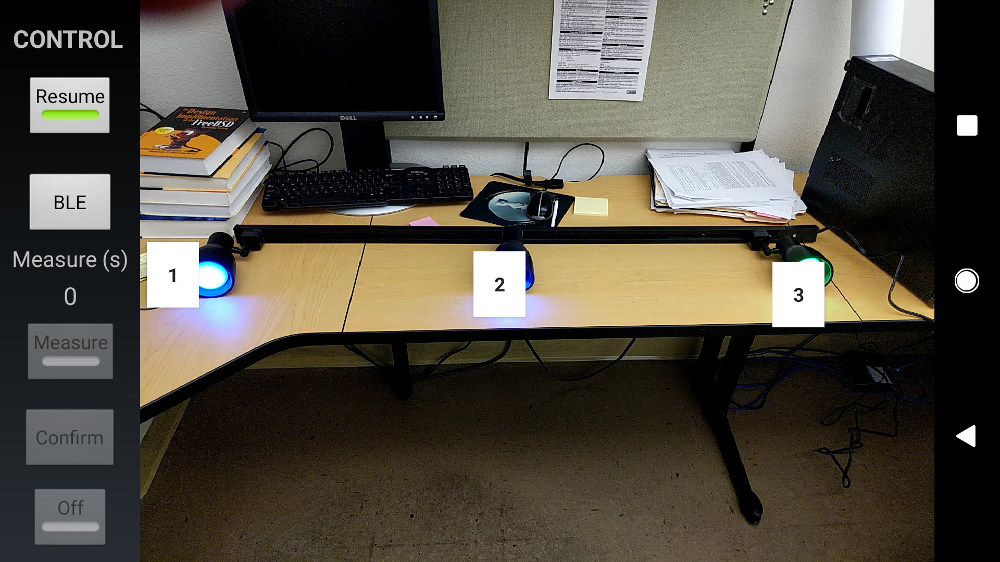
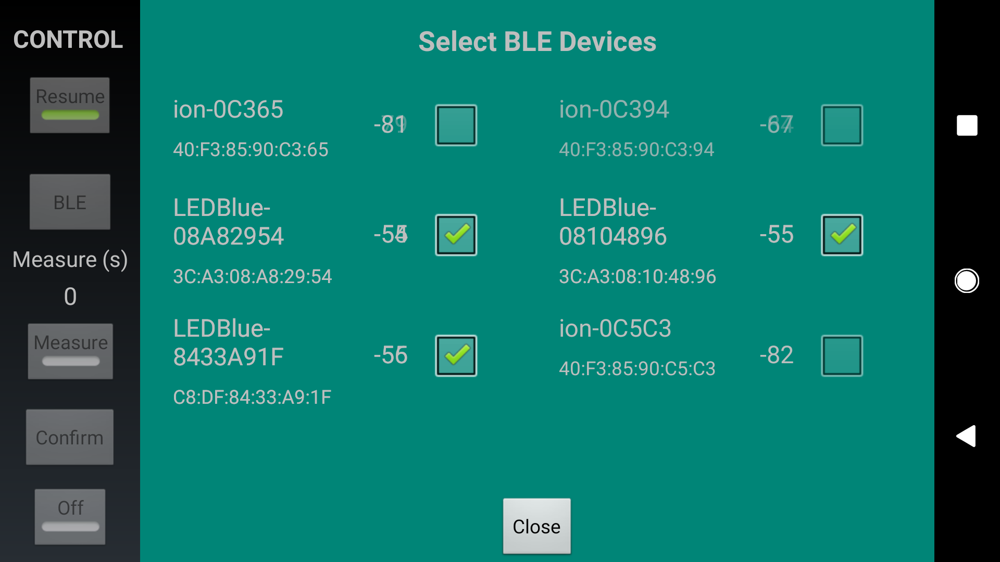
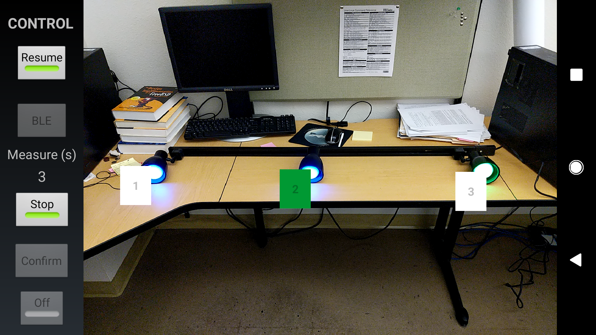
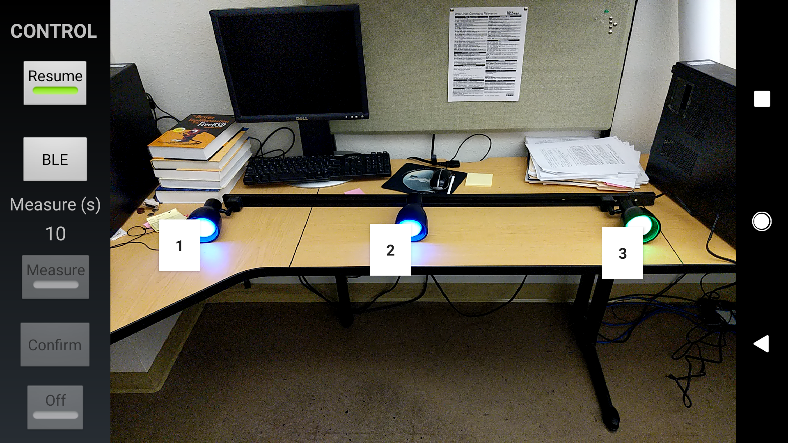
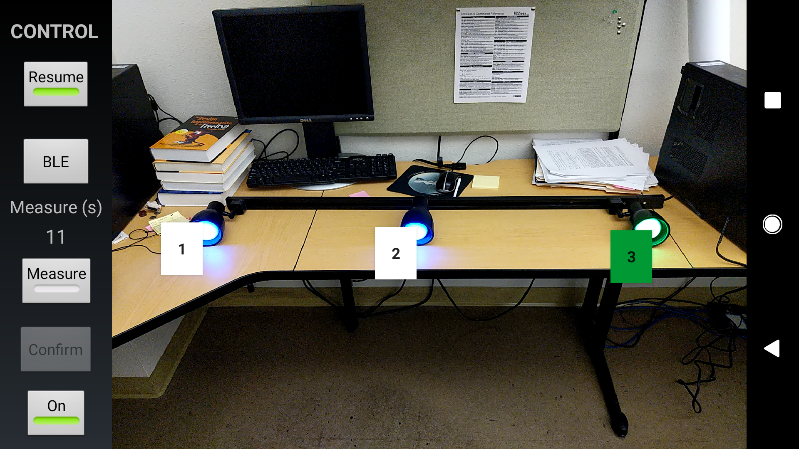

Android Demo App Code for AIDE

Paper published in HotMobile, Santa Cruz, 2019  
[AIDE: Augmented Onboarding of IoT Devices at Ease](https://www.huanlezhang.com/publication/conference/aide_hotmobile_19/paper.pdf)

Authors:  
Huanle Zhang, Mostafa Uddin, Fang Hao, Sarit Mukherjee and Prasant Mohapatra

**We will release code in a few days.**

### Illustration

1. Open app, take a picture

2. Click on screen to label light bulbs

3. Open BLE configuration, check candidate BLE devices, and close

4. Click each label of light bulbs, and measure. The measurement time for that location is shown on the left

5. After measuring at all locations, click confirm. The AIDE algorithms runs to associate BLE IDs to light bulbs.

6. Finally, click each label of light bulb to control it.

