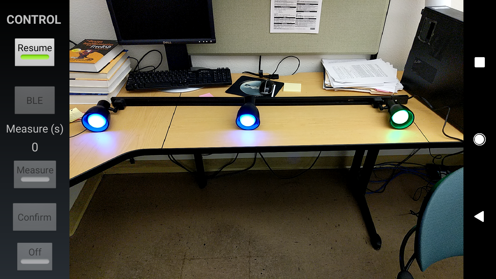

Android Demo App Code for AIDE

Paper published in HotMobile, Santa Cruz, 2019  
[AIDE: Augmented Onboarding of IoT Devices at Ease](https://www.huanlezhang.com/publication/conference/aide_hotmobile_19/paper.pdf)

Best Demo Award in HotMobile'19

Authors:  
Huanle Zhang, Mostafa Uddin, Fang Hao, Sarit Mukherjee and Prasant Mohapatra

### Demo Equipment

1. Bluetooth light bulbs. We use MagicLight Bluetooth Smart Light Bulb, available on Amazon. Here is a link: https://www.amazon.com/Magic-Light-Bluetooth-Smart-Bulb/dp/B073S1KV4F?ref_=bl_dp_s_web_9321634011

1. An Android Phone. We use a Google Pixel 2

### Instructions

* Android source code is under *Android* folder

* MagicLight Bluetooth light bulbs can be controlled with the following format:

    ```
    LED service UUID
    0000ffe5-0000-1000-8000-00805f9b34fb

    LED characteristic UUID
    0000ffe9-0000-1000-8000-00805f9b34fb

    Color control Attribute
    56 RR GG BB 00 f0 aa

    Brightness control Attribute
    56 00 00 00 LL 0f aa
    ```
    More details refer to this [repo](https://github.com/skydoves/MagicLight-Controller)

### Illustration

1. Open app, take a picture

<p align="center">

</p>

2. Click on screen to label light bulbs

<p align="center">

</p>

3. Open BLE configuration, check candidate BLE devices, and close

<p align="center">

</p>

4. Click each label of light bulbs, and measure. The measurement time for that location is shown on the left

<p align="center">

</p>

5. After measuring at all locations, click confirm. The AIDE algorithms runs to associate BLE IDs to light bulbs.

<p align="center">

</p>

6. Finally, click each label of light bulb to control it.

<p align="center">

</p>
